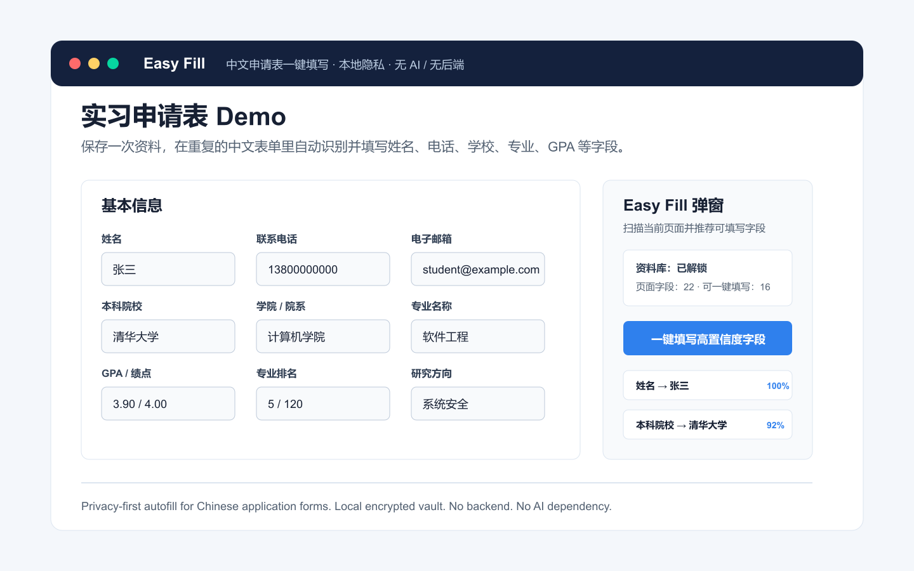

# Easy Fill

<p align="center">
  <a href="#中文">中文</a> · <a href="#english">English</a>
</p>

<p align="center">
  <a href="https://github.com/WLwl1/easy-fill/actions/workflows/ci.yml"></a>
  <a href="LICENSE"></a>
  <a href="#安装"></a>
</p>



<a id="中文"></a>

## 中文

Easy Fill 是一个面向中文申请表的隐私优先浏览器扩展。它帮学生和求职者把姓名、电话、邮箱、学校、学院、专业、GPA、排名等高频资料保存在本地，在实习申请、保研/考研材料、奖学金系统、校园门户里自动识别字段并一键填写。


## 适合谁

- 正在批量填写实习、校招、奖学金、夏令营、推免、研究生申请表的学生
- 经常遇到中文字段、动态弹窗、日期选择器、自定义下拉框的用户
- 希望自动填表，但不想把个人资料上传到云端的人
- 想贡献中文表单字段别名、真实站点兼容性和浏览器扩展能力的开发者

## 功能亮点

- 本地资料库，使用主密码加密保存
- 无账号、无后端、无遥测、无 AI API 调用
- 支持动态页面、弹窗、同源 iframe
- 支持文本框、`select`、自定义下拉、日期类输入
- 使用可解释的规则匹配，不靠黑箱模型
- 自动跳过密码、验证码、银行卡、CVV、支付等高风险字段

## 安装

| 渠道 | 状态 | 链接 |
| --- | --- | --- |
| Chrome Web Store | 准备上架 | 待发布后替换为商店链接 |
| Microsoft Edge Add-ons | 准备上架 | 待发布后替换为商店链接 |
| 本地开发安装 | 可用 | 见下方步骤 |

本地安装：

```bash
npm install
npm run build
```

然后打开 `chrome://extensions` 或 `edge://extensions`，开启 Developer Mode，点击 "Load unpacked"，选择 `build/chrome-mv3-prod`。

## 在线 Demo

- [打开 demo 表单](docs/demo.html)
- 先在扩展设置页保存一份测试资料
- 打开 demo 表单后点击 Easy Fill 弹窗，即可扫描并填写中文申请字段

Demo 页面只包含本地静态表单，不收集任何信息。

## 开发

```bash
npm install
npm run dev
```

常用命令：

```bash
npm run typecheck
npm test
npm run build
```

## 工作原理

Easy Fill 当前不使用大模型。匹配流程是：

1. 扫描页面中的 `input`、`textarea`、`select`
2. 提取 label、placeholder、name、id、aria-label、附近文本和区块标题
3. 与资料字段别名进行规则匹配和加权评分
4. 对高置信度字段一键填写，对低置信度字段保留人工确认

这种方式速度快、成本低、可解释，也更适合处理隐私资料。

## 项目结构

```text
src/
  background/    extension background worker
  content.ts     page scanning and overlay UI
  lib/           matching, scanning, filling, storage, security
  options/       profile vault editor
  popup/         extension popup
tests/           unit and integration tests
docs/            demo pages and project documentation assets
```

## 贡献

欢迎贡献，尤其适合从这些方向开始：

- 增加中文字段别名
- 补充真实学校系统、招聘系统、奖学金系统兼容性
- 改进 Ant Design、Element Plus 等控件填写能力
- 增加测试和 demo 用例
- 改进 README、截图、上架文档和新手体验

更多计划见 [ROADMAP.md](ROADMAP.md)，贡献指南见 [CONTRIBUTING.md](CONTRIBUTING.md)。

## English

Easy Fill is a privacy-first browser extension for repetitive Chinese application forms. It helps students and job seekers save profile information locally, detect web form fields, match them with deterministic heuristics, and fill them with one click.

The core value is simple: Chinese application forms, local privacy, no AI dependency, and no backend.

## Who It Is For

- Students filling internship, scholarship, graduate-school, recommendation, or campus portal forms
- Users dealing with Chinese labels, dynamic modals, date pickers, and custom dropdowns
- People who want autofill without uploading personal data to a cloud service
- Developers interested in browser extensions, form understanding, and privacy-first tooling

## Highlights

- Local encrypted profile vault protected by a master password
- No account system, backend, telemetry, or AI API calls
- Works with dynamic pages, modals, and same-origin iframes
- Supports text fields, native selects, custom dropdowns, and date-like inputs
- Explainable rule-based matching instead of opaque model decisions
- Ignores high-risk fields such as passwords, verification codes, bank cards, CVV, and payment fields

## Install

| Channel | Status | Link |
| --- | --- | --- |
| Chrome Web Store | Preparing release | Replace with store link after publishing |
| Microsoft Edge Add-ons | Preparing release | Replace with store link after publishing |
| Local development install | Available | See steps below |

Local install:

```bash
npm install
npm run build
```

Open `chrome://extensions` or `edge://extensions`, enable Developer Mode, click "Load unpacked", and choose `build/chrome-mv3-prod`.

## Demo

- [Open the demo form](docs/demo.html)
- Save a test profile in the extension options page
- Open the Easy Fill popup on the demo page to scan and fill Chinese application fields

The demo page is static and does not collect data.

## Development

```bash
npm install
npm run dev
```

Useful commands:

```bash
npm run typecheck
npm test
npm run build
```

## How Matching Works

Easy Fill does not use a large language model. The current matching flow is:

1. Scan `input`, `textarea`, and `select` fields
2. Extract label text, placeholder, name, id, aria-label, nearby text, and section context
3. Compare those signals with profile field aliases using weighted heuristics
4. Fill high-confidence matches and keep uncertain matches confirmable

This keeps the extension fast, local, predictable, and cheap to run.

## Tech Stack

- TypeScript
- React
- Plasmo
- Vitest

## Roadmap

See [ROADMAP.md](ROADMAP.md).

## License

MIT. See [LICENSE](LICENSE).
